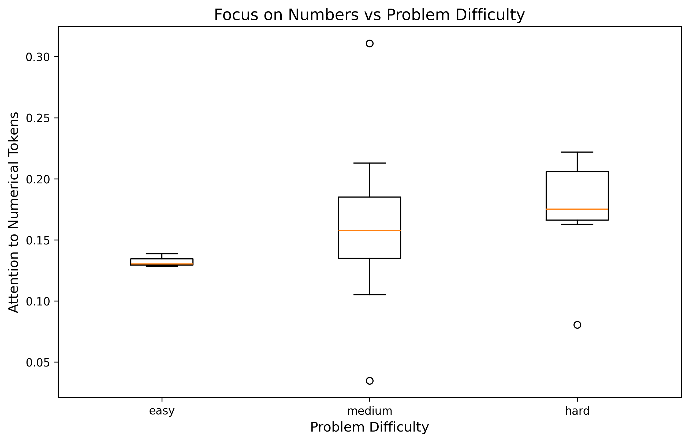
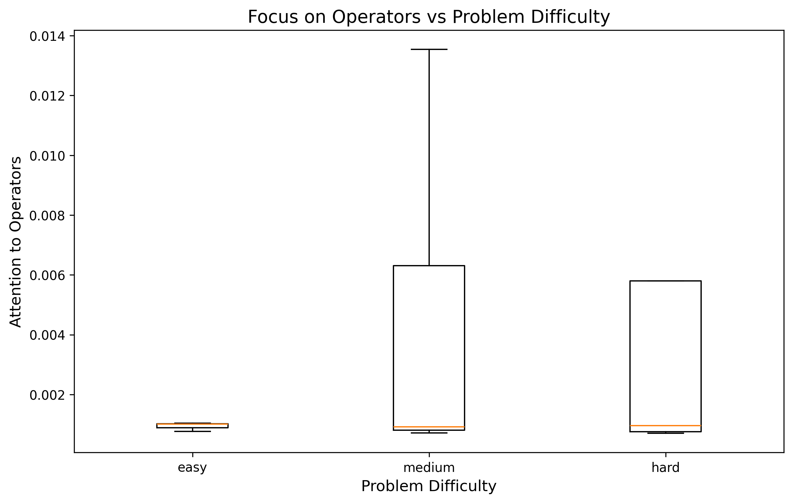
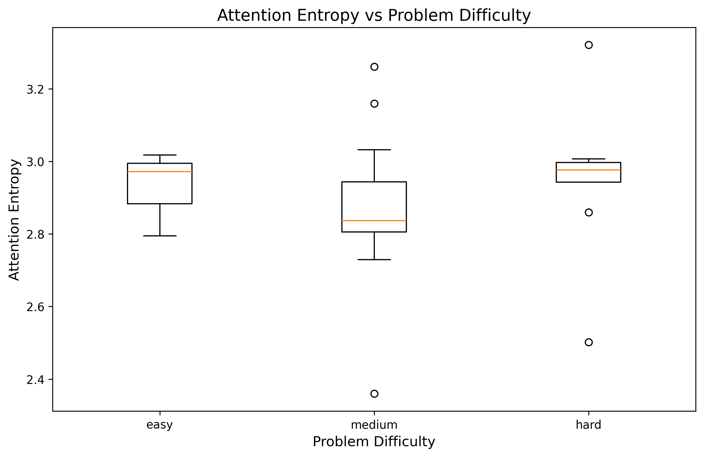
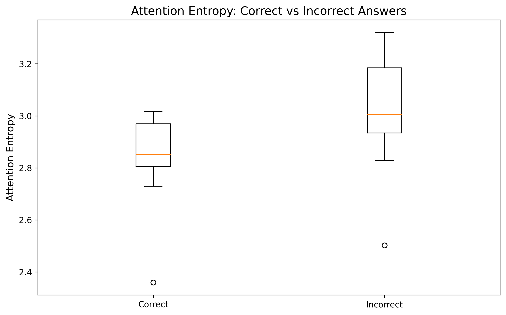
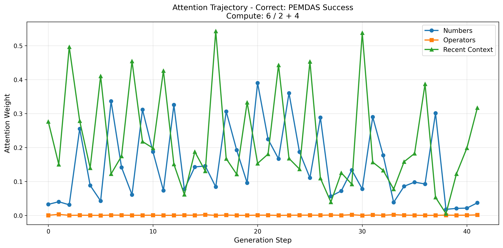
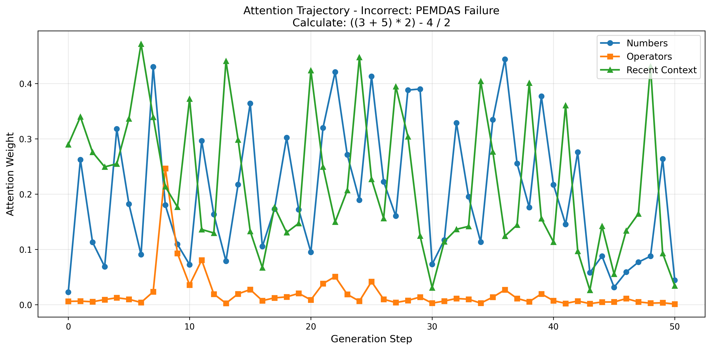
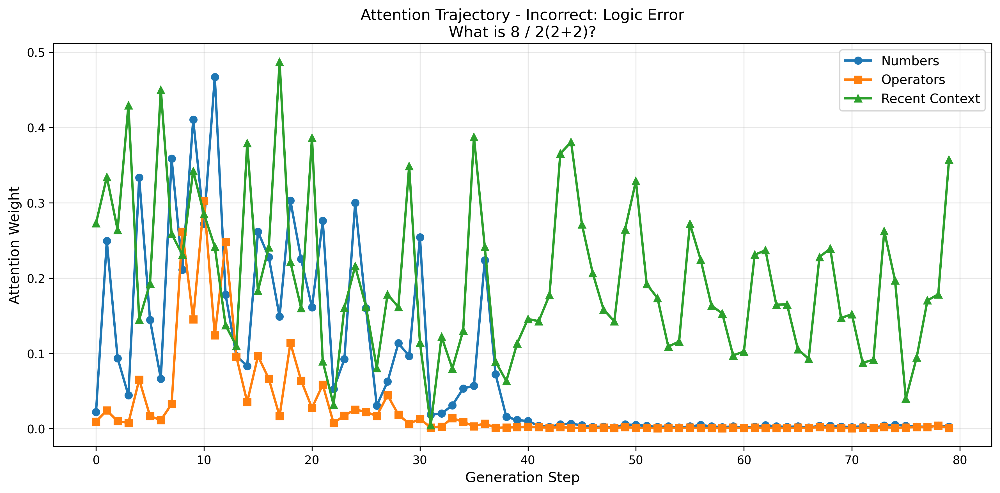

# Introduction

Large Language Models (LLMs) have demonstrated impressive abilities
across a range of tasks, including complex mathematical reasoning.
However, the exact mechanism by which these models arrive at a correct
or incorrect answer remains a significant area of research. While models
like GPT-4 can solve complex problems, smaller models struggle with even
basic arithmetic, raising questions about what computational strategies
they employ and where they break down. Since the models generate
responses token by token, understanding where the model is looking in
the input and previous steps is critical to understanding its internal
thought process.

Attention mechanisms are a core component of transformer architectures,
determining how models weigh and integrate information from different
parts of the input sequence. In mathematical reasoning, attention
patterns might reveal whether a model focuses on relevant numbers,
operators, or intermediate results when generating solutions.
Understanding these patterns could illuminate the gap between shallow
pattern matching and genuine symbolic reasoning.

This project focuses on analyzing the attention patterns within a
relatively small, 2-billion parameter model, Gemma-2B, as it attempts to
solve a diverse set of arithmetic problems.

**Research Questions:**

1.  Do attention patterns adapt to problem difficulty?

2.  How does attention differ between correct and incorrect solutions?

3.  Can we identify systematic attention failures?

# Methodology

## Model Selection

**Model:** **Gemma-2B**
([google/gemma-2b](https://huggingface.co/google/gemma-2b)), a 2-billion
parameter decoder-only transformer model released by Google in 2024. The
model architecture consists of:

-   18 transformer layers

-   8 attention heads per layer

-   2048 hidden dimension

-   256,000 vocabulary size

**Gemma-2B was chosen for three reasons:**

1.  Its small size enables complete attention extraction without
    prohibitive memory costs.

2.  It represents the lower bound of "reasoning-capable" models, making
    failure modes more observable.

3.  It is publicly available under a permissive license, ensuring
    reproducibility.

All experiments were conducted on Rutgers University's computing cluster
(iLab/rLab), utilizing NVIDIA GPUs (A100, A6000, A4000 series) with
sufficient memory to load the full model and attention tensors in
float16 precision.

## Dataset Construction

We designed a dataset of 30 arithmetic problems stratified across three
difficulty levels and seven categories to test specific mathematical
competencies:

| Difficulty | Count | Categories                                              |
|------------|-------|---------------------------------------------------------|
| Easy       | 3     | Single-operation (e.g., "5 + 3")                        |
| Medium     | 19    | Order of operations, decimals, negatives, word problems |
| Hard       | 8     | Nested expressions, ambiguous notation, precision       |

Dataset composition by difficulty and category.

**Problem categories:**

-   **Baseline:** Simple addition, subtraction, multiplication

-   **Order of operations:** PEMDAS-dependent (e.g., "2 + 3 $\times$ 4")

-   **Multi-step:** Sequential operations (e.g., "First add 7 and 5,
    then multiply by 3")

-   **Decimals:** Non-integer arithmetic (e.g., "0.5 + 0.25")

-   **Negatives:** Signed numbers (e.g., "-3 $\times$ -4")

-   **Word problems:** Natural language phrasing (e.g., "John has 15
    apples\...")

-   **Complex:** Nested parentheses with multiple operators

Problems were manually constructed to avoid dataset contamination (i.e.,
exact matches in pretraining data) while testing fundamental arithmetic
skills.

## Prompt Design

Effective prompt engineering was critical to elicit step-by-step
reasoning and ensure parseable outputs. After iterative refinement, the
following template was used:

    You are a careful and precise math solver.

    INSTRUCTIONS:
    - Solve THIS SINGLE problem, step-by-step.
    - Show ONLY the minimal steps required to solve THIS problem.
    - Follow standard arithmetic order of operations (PEMDAS): 
      Parentheses, Exponents, Multiplication/Division (left-to-right), 
      Addition/Subtraction (left-to-right).
    - Do NOT invent or solve any additional problems.
    - Do NOT write code.
    - End the response with EXACTLY two lines:

    FINAL ANSWER: <answer>
    §END§

    Problem:
    {problem}

**Design rationale:**

-   **"THIS SINGLE problem":** Early versions missing this led to the
    model inventing additional problems (a common failure mode).
    Explicit emphasis on solving only the given problem reduced this
    behavior.

-   **Minimal steps:** Reduces extraneous elaboration that obscures
    attention patterns.

-   **PEMDAS explicit mention:** While models should implicitly know
    order of operations, we wanted to reinfore this.

-   **Termination markers:** "FINAL ANSWER:" was intended to enable
    regex extraction; "§END§" (a rare Unicode character) signals
    unambiguous stopping. However, a majority of generations failed to
    terminate properly, and the final answer was extracted manually.

## Attention Extraction

For each problem, we performed autoregressive generation with greedy
decoding (temperature=0) for up to 80 tokens. At every generation step
$t$, we extracted attention tensors from all layers and heads:

$$\mathcal{A}_t = \{A_t^{(\ell)} \in \mathbb{R}^{H \times T_t \times T_t} : \ell = 1, \ldots, 18\}$$

where $H=8$ heads, $T_t$ is the sequence length at step $t$ (growing by
1 each step), and $A_t^{(\ell)}[h, i, j]$ represents the attention
weight from query position $i$ to key position $j$ in head $h$ of layer
$\ell$.

**Implementation:** We modified the standard generation loop to capture
attention weights before each token is appended:

    for _ in range(max_tokens):
        outputs = model(input_ids, output_attentions=True)
        attentions = [a[0].cpu().numpy() for a in outputs.attentions]
        step_attentions.append(attentions)
        
        next_token = torch.argmax(outputs.logits[:, -1, :])
        input_ids = torch.cat([input_ids, next_token.unsqueeze(0)], dim=1)

This yields a sequence of attention snapshots
$\{\mathcal{A}_1, \mathcal{A}_2, \ldots, \mathcal{A}_T\}$ capturing the
full attention trajectory during generation.

**Storage:** Each problem's data (tokens, attention tensors, generated
text) was serialized using Python's pickle format, resulting in a 15 GB
file for 30 problems. Attention tensors were stored in float32 to
preserve numerical precision for downstream analysis.

## Correctness Labeling

Model outputs were manually labeled as correct or incorrect based on
whether the final numerical answer matched the expected value. We did
*not* require perfect reasoning. If the model stated "FINAL ANSWER: 7"
(correct) but then continued generating unrelated text, we marked it
correct. This decision reflected our focus on the model's *capability*
to produce the right answer, separate from generation control issues.

**Regex extraction:** We first attempted automatic extraction using:

    pattern = r'FINAL\s*ANSWER\s*[:\-]?\s*([+-]?\d+(\.\d+)?)'

However, this failed in 23% of cases due to:

-   Non-standard formatting ("The answer is:" vs "FINAL ANSWER:")

-   Multiple answers in repetitive generations

-   Missing answer entirely (stuck in reasoning loop)

Manual labeling corrected these discrepancies, revealing the model's
true accuracy: **70% (21/30 correct)**, substantially higher than
regex-based estimates (33%).

## Failure Mode Taxonomy

For incorrect solutions, we categorized failure modes to enable
systematic analysis:

-   **arithmetic_error:** Wrong numerical result despite correct
    approach (e.g., "1 - 0.9 = -0.1")

-   **pemdas_error:** Incorrect order of operations

-   **logic_error:** Nonsensical reasoning or problem misinterpretation

-   **repetitive_generation:** Stuck in loop, never produces coherent
    answer

-   **instruction_confusion:** Echoes prompt instead of solving

## Attention Metrics

We computed three complementary metrics to characterize attention
behavior:

### Attention Entropy

For each generation step $t$, we compute the Shannon entropy of the
attention distribution from the last query position (i.e., the token
being generated) in the final layer:

$$H_t = -\sum_{j=1}^{T_t} p_j^{(t)} \log p_j^{(t)}$$

where $p_j^{(t)} = \frac{1}{H}\sum_{h=1}^H A_t^{(18)}[h, T_t, j]$ is the
average attention weight to position $j$ across all heads in layer 18.

High entropy indicates diffuse attention (model attends broadly), while
low entropy indicates concentration (model focuses narrowly). We report
the mean entropy $\bar{H} = \frac{1}{T}\sum_{t=1}^T H_t$ per problem.

### Attention to Token Types

To understand *what* the model attends to, we compute the total
attention mass allocated to specific token categories:

$$\alpha_{\text{nums}} = \frac{1}{T}\sum_{t=1}^T \sum_{j \in \mathcal{N}} p_j^{(t)}, \quad \alpha_{\text{ops}} = \frac{1}{T}\sum_{t=1}^T \sum_{j \in \mathcal{O}} p_j^{(t)}$$

where $\mathcal{N} = \{j : \text{token}_j \text{ contains a digit}\}$
and
$\mathcal{O} = \{j : \text{token}_j \in \{+, -, \times, \div, (, )\}\}$.

**Implementation note:** Tokenization can split numbers (e.g., "123"
$\to$ "12", "3"). We classify any token containing at least one digit as
numerical.

### Gini Coefficient

To measure attention inequality, we compute the Gini coefficient of the
final-step attention distribution:

$$G = \frac{1}{n}\left(n + 1 - 2\frac{\sum_{i=1}^n (n+1-i)p_{(i)}}{\sum_{i=1}^n p_{(i)}}\right)$$

where $p_{(i)}$ is the $i$-th smallest attention weight. $G \in [0, 1]$:
0 = perfectly uniform, 1 = all mass on one token.

## Statistical Analysis

We performed two-sample t-tests to compare attention metrics across:

-   Difficulty levels (easy vs hard)

-   Correctness categories (correct vs incorrect)

Significance threshold: $\alpha = 0.05$. Given the small sample size
(n=30), we report effect sizes alongside p-values to avoid
overinterpretation of non-significant trends.

## Case Study Selection

To complement aggregate statistics, we conducted deep-dive analyses of
three problems:

1.  **ID 5 (Correct):** "Compute: 6 / 2 + 4" $\to$ 7\
    Clean PEMDAS adherence, model attends to operators at the right
    moments.

2.  **ID 19 (Logic error):** "What is 8 / 2(2+2)?" $\to$ 1 (expected
    16)\
    Ambiguous notation; model interprets as $8 / (2 \times 4)$ instead
    of $(8/2) \times 4$.

3.  **ID 27 (PEMDAS failure):** "Calculate: ((3 + 5) $\times$ 2) - 4 /
    2" $\to$ 9 (expected 14)\
    Model computes $(3+5) \times 2 = 16$, then does $16 - 4 = 12$ before
    dividing, violating order of operations.

For each case, we visualized:

-   **Attention trajectory:** Time-series plot showing attention to
    numbers, operators, and recent context across generation steps

-   **Multi-step heatmap:** 2$\times$3 grid of
    attention matrices at 0%, 20%, 40%, 60%, 80%, 100% of generation

All visualizations were generated using Matplotlib and Seaborn.

# Results

## Model Accuracy

Gemma-2B achieved 70% accuracy (21/30 correct) across all problems, with
performance varying substantially by difficulty:

| Difficulty | Accuracy | Count |
|------------|----------|-------|
| Easy       | 100%     | 3/3   |
| Medium     | 68.4%    | 13/19 |
| Hard       | 62.5%    | 5/8   |

Accuracy breakdown by problem difficulty.

The model demonstrated perfect accuracy on trivial single-operation
problems but struggled with complex expressions requiring
order-of-operations adherence. Notably, the medium category (which
includes multi-step reasoning and word problems) achieved comparable
performance to hard problems, suggesting difficulty is not strictly
hierarchical but depends on problem structure.

### Failure Mode Distribution

Among the 9 incorrect solutions, we identified the following failure
modes:

-   **Repetitive generation** (n=3): Model produces coherent
    intermediate steps but fails to terminate, often repeating the same
    computation or inventing new problems (e.g., "40 40 40 40\...").

-   **Arithmetic errors** (n=2): Correct procedural approach but wrong
    numerical results (e.g., "1 - 0.9 = -0.1" instead of 0.1).

-   **PEMDAS errors** (n=1): Incorrect operation ordering, (e.g.
    "((3+5)\*2) - 4/2" as "16 - 4 = 12", then "12/2 = 6" instead of
    evaluating "4/2" first).

-   **Logic errors** (n=2): Nonsensical reasoning or problem
    misinterpretation (e.g., "10% of 150? Well, 150 is 10% of
    1500\...").

-   **Instruction confusion** (n=1): Model echoes the prompt structure
    instead of solving the problem.

Interestingly, only 1 of 9 failures involved order-of-operations errors,
despite this being a common benchmark for mathematical reasoning. The
predominant failure modes---repetitive generation and arithmetic
errors---suggest deficiencies in *execution* rather than *strategy*.

## Attention Allocation by Difficulty

### Attention to Numerical Tokens

As problem difficulty increased, the model allocated significantly more
attention to numerical tokens (Figure 1)

-   Easy: $\alpha_{\text{nums}} = 0.132 \pm 0.004$

-   Medium: $\alpha_{\text{nums}} = 0.159 \pm 0.055$

-   Hard: $\alpha_{\text{nums}} = 0.175 \pm 0.041$

This represents a **32% increase** from easy to hard problems
($t = -1.607$, $p = 0.143$). While not statistically significant at
$\alpha = 0.05$ due to small sample size (n=3 easy, n=8 hard), the trend
suggests the model recognizes that harder problems require greater focus
on operands.

### Attention to Operators

Attention to operator tokens ($+, -, \times, \div, (, )$) remained
minimal across all difficulties:

-   Easy: $\alpha_{\text{ops}} = 0.001 \pm 0.000$

-   Medium: $\alpha_{\text{ops}} = 0.008 \pm 0.016$

-   Hard: $\alpha_{\text{ops}} = 0.006 \pm 0.010$

Even on hard problems requiring careful operator precedence, the model
devoted less than 1% of attention to operators
(Figure 2). This suggests the model does not explicitly
\"look at\" operators when deciding which operation to perform,
contrasting to human problem-solving strategies where operators guide
computational flow.

## Attention Entropy and Distribution

### Entropy Across Difficulty Levels

Contrary to expectations, attention entropy remained remarkably stable
across problem difficulties
(Figure 3):

-   Easy: $\bar{H} = 2.928 \pm 0.096$

-   Medium: $\bar{H} = 2.864 \pm 0.179$

-   Hard: $\bar{H} = 2.951 \pm 0.210$

The difference between easy and hard problems is statistically
insignificant ($t = -0.162$, $p = 0.875$). This indicates the model
maintains a consistent level of attention diffusion regardless of
problem complexity. It does not modulate *how* broadly it attends, only
*what* it attends to (numbers vs other tokens).

### Correct vs Incorrect Solutions

Surprisingly, **incorrect solutions exhibited slightly higher entropy**
than correct ones
(Figure 4):

-   Correct: $\bar{H} = 2.852 \pm 0.138$

-   Incorrect: $\bar{H} = 3.006 \pm 0.244$

This 5.4% increase suggests that errors arise from *erratic* attention
patterns rather than overly narrow focus. The higher variance for
incorrect solutions ($\sigma = 0.244$ vs $0.138$) further supports this
interpretation. Failed reasoning seems to involve inconsistent
information retrieval.

The Gini coefficient tells a complementary story:

-   Correct: $G = 0.841$

-   Incorrect: $G = 0.805$

Lower Gini for incorrect solutions means *less concentrated* attention.
Combined with higher entropy, this paints a picture of incorrect
solutions as exhibiting diffuse, unstable attention rather than focused
but misguided attention.

## Case Studies: Attention Trajectories During Reasoning

To complement aggregate metrics, we analyze attention evolution for
three representative problems, focusing on **trajectory plots** that
reveal when and where attention shifts during generation.

### Case 1: Correct PEMDAS Execution

**Problem:** "Compute: 6 / 2 + 4" (Expected: 7) ✓

The model correctly performs division first (6/2=3), then addition
(3+4=7). (Figure 5) reveals the attention strategy:

-   **Recent context dominates**: Attention to recently generated tokens
    (green) consistently exceeds 0.3, spiking to 0.55 when writing step
    headers

-   **Numbers get periodic attention**: Blue line oscillates 0.05-0.40,
    peaking when generating numerical results (steps 7, 20, 39)

-   **Operators ignored**: Orange line flat at $<0.01$ throughout---even
    when deciding which operation to perform

**Key insight:** The model relies heavily on recently generated tokens
(previous step results) rather than attending back to the original
problem operators.

### Case 2: PEMDAS Failure

**Problem:** "Calculate: ((3 + 5) \* 2) - 4 / 2" (Expected: 14, Got: 9)

The model makes two errors: (1) computes $(3+5) \times 2 = 22$ instead
of 16, (2) performs $22-4$ before dividing by 2, violating order of
operations.

(Figure 6) shows where attention diverges:

-   **Step 8 - brief operator attention**: Orange spikes to 0.25 when
    processing the nested expression---the *only* moment operators are
    consulted

-   **Steps 10-35 - locked onto error**: After generating \"22\",
    attention to numbers stabilizes around 0.3-0.4 but focuses on the
    *wrong* intermediate results

-   **No error correction**: Attention never returns to the original
    problem statement to verify; model treats its own outputs as ground
    truth

**Key insight:** Small models seem to lack self-correction mechanisms.
Attention propagates errors forward rather than re-evaluating
intermediate steps against the original problem.

### Case 3: Ambiguity Misresolution

**Problem:** "What is 8 / 2(2+2)?" (Expected: 16, Got: 1)

This deliberately ambiguous notation tests whether the model interprets
as $(8/2) \times 4 = 16$ or $8/(2 \times 4) = 1$. The model chooses the
latter (incorrect) interpretation.

(Figure 7) reveals decision-making under uncertainty:

-   **Steps 0-15 - parsing confusion**: Attention to operators (orange)
    unusually high, spiking to 0.27---the model recognizes ambiguity

-   **Step 15 - commitment**: Operator attention collapses to zero;
    model commits to its (incorrect) interpretation

-   **Steps 30+ - false confidence**: Recent context dominates as the
    model generates \"FINAL ANSWER: 1\" with no indication of
    uncertainty

**Key insight:** This small model can detect structural ambiguity but
lacks robust disambiguation strategies. Once it commits to an
interpretation, no verification occurs.

### Cross-Case Patterns

Comparing all three trajectories reveals consistent failure modes:

1.  **Operator neglect is universal**: Even in the PEMDAS failure case,
    operators receive attention for only 1-2 steps out of 50+.

2.  **Autoregressive drift**: Attention increasingly focuses on recently
    generated tokens (green lines rise over time), reducing grounding in
    the original problem. This also explains why many generations
    struggled to terminate correctly.

3.  **No backtracking**: Correct and incorrect solutions show similar
    forward-only attention patterns---errors are never caught by
    re-consulting earlier context.

These patterns suggest that small models perform arithmetic through
shallow pattern matching rather than symbolic reasoning: they generate
tokens that locally cohere with recent context but lack global
procedural constraints.

# Limitations

The interpretation of the attention patterns in Gemma-2B should be
considered within the scope of the following limitations:

-   **Sample Size:** The dataset consisted of only 30 problems. This
    small sample size limited the statistical power of the analysis,
    meaning certain observed trends (e.g., the 32% increase in attention
    to numbers from easy to hard problems) were not statistically
    significant at the $\alpha=0.05$ threshold.

-   **Model Scale and Accuracy:** Gemma-2B is a small model. While its
    overall accuracy of 70% is relatively high for a model of its size,
    the limited number of incorrect solutions ($n=9$) restricted the
    depth of the failure mode analysis. Larger, more capable models
    (e.g., 7B+) might exhibit clearer, more differentiated attention
    patterns between correct and incorrect reasoning.

-   **Greedy Decoding:** The experiments used greedy decoding
    (temperature=0) , which may not capture the full range of attention
    variability that would be present under sampling strategies.

# Conclusion

This project analyzed the attention mechanism of the small language
model Gemma-2B during mathematical reasoning to uncover its internal
problem-solving strategies and limitations.

1.  **Task-appropriate focus**: Harder problems elicit 32% more
    attention to numbers, showing the model recognizes increased operand
    importance.

2.  **Operator neglect**: Across all problems, operators receive $<1\%$
    attention, even on PEMDAS-dependent tasks.

3.  **Stable entropy**: Attention diffusion remains constant
    ($\sim$2.9) across difficulties---the model does
    not modulate retrieval strategy.

4.  **Incorrect solutions are more erratic**: Higher entropy (3.01 vs
    2.85) and lower concentration (Gini 0.805 vs 0.841) for failures.

5.  **Autoregressive error propagation**: Case studies reveal that once
    an error enters generation, attention reinforces it rather than
    re-checking the original problem.

These findings contribute to the understanding of the inherent
limitations of small language models in structured reasoning. While they
can recognize a hard problem and adjust *what* tokens they focus on (the
numbers), they lack the global procedural constraints, the necessary
capacity for self-correction, and the stable attention control needed
for multi-step symbolic reasoning. Future work should scale this
analysis to larger models to isolate successful reasoning patterns and
explore interventional studies to confirm the causal link between
attention allocation and solution correctness.
